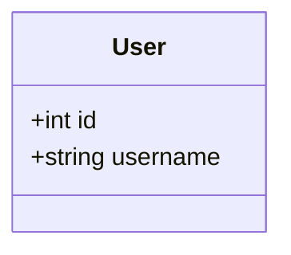
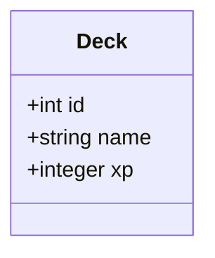
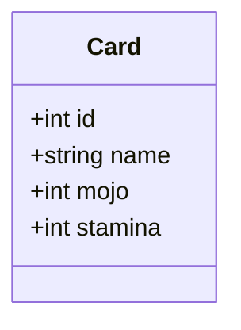
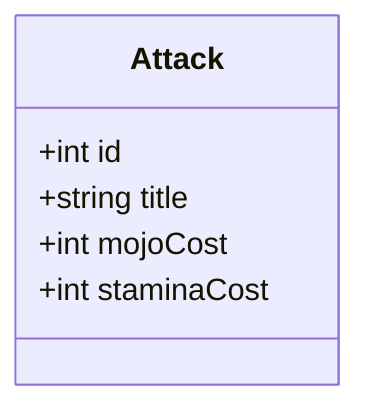
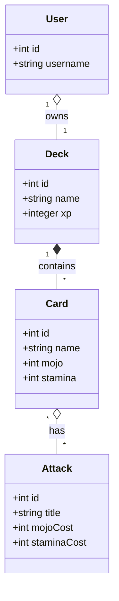

# MOJO: The Summoning

_Mojo: The Summoning_ is a card-collecting game where players battle 1 on 1 using their decks of Cards.

This is an existing codebase that your team have already been working on. You will be working in the `server` folder to set up the database layer. You will need to configure Sequelize, and then define and test models and associations.

## Connection to Sequelize

Once you have the project locally on your machine, you're ready to start work.

### Install dependencies

 - `cd` into the `server` directory
 - Then, use `npm` to install the `sqlite3`, `sequelize` and `jest` packages.

:warning: **Warning:** Make sure you `cd` into `server` first! This project has multiple folders and you do not want to install dependencies into the wrong one.

### Configure your connection

 - In `server/src/db/config.js` connect to your database using Sequelize.

## Define models

Work in the `server/src/models` directory.

### User



(This file has been created but is empty.)

### Decks



(This file does not exist. You need to create it in the `models` directory.)

### Cards



### Attacks



### Test

 - One test file has been started for you in `models/User.test.js`.
 - Continue to write unit tests which check that each of your models functions correctly.
 - It is recommended to import into your test files from `models/index.js`. 
 - Run the tests with `npm run test`.

## Define associations



You should set up the associations in `models/index.js`.

### User/Deck

Each User may create exactly one Deck.

E.g. A User `gandalf` might create a Deck called `The Fellowship`.

 - Associate Users and Decks with a one-to-one relationship.
 - Add tests to check the association.

### Deck/Card

Each Deck may contain many Cards. A Card may only belong to one Deck.

E.g. `The Fellowship` might contain Cards called `Lizard Wizard` and `Bulk Brogan`. (Two Decks might contain Cards with the same name, but these are considered different Cards, and would have different IDs.)

 - Associate Decks and Cards with a one-to-many association
 - Add tests to check the association

### Card/Attack

Each Card may have many Attacks. Each Attack may belong to many Cards.

E.g. `Lizard Wizard` and `Bulk Brogan` might both have a `Charge` attack. Lizard Wizard might have a `Thunderbolt` and `Bulk Brogan` a `Piledriver`.

 - Associate Cards and Attacks with a many-to-many association
 - Add tests to check the association
 
## Try out the app
 
If you're models are successfully defined, you should be able to run the app and view the results in the browser.
 
 1. In a terminal, `cd` into `server` and run
 ```bash
 npm install
 npm run seed
 npm run dev
 ```
 This will start the development server (the back-end).
 
 1. In a separate terminal, `cd` into `client` and run
 ```bash
 npm install
 npm run dev
 ```
 This will start the client (the front-end). You should see a url (usually localhost:5173). Visit this url in your browser to see the client displaying data requested from the database.

Well done! You provided the database functionality for the app and it is now working :)

**Tip**: to stop the servers running, click in the terminal and press `ctrl + c`
