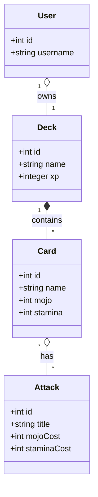

# Design

## Class diagram

```mermaid
classDiagram
  class User {
    +int id
    +string username
  }
  class Deck {
    +int id
    +string name
    +integer xp
  }
  class Card {
    +int id
    +string name
    +int mojo
    +int stamina
  }
  class Attack {
    +int id
    +string title
    +int mojoCost
    +int staminaCost
  }
  User "1" o-- "1" Deck : owns
  Deck "1" *-- "*" Card : contains
  Card "*" o-- "*" Attack : has
```
